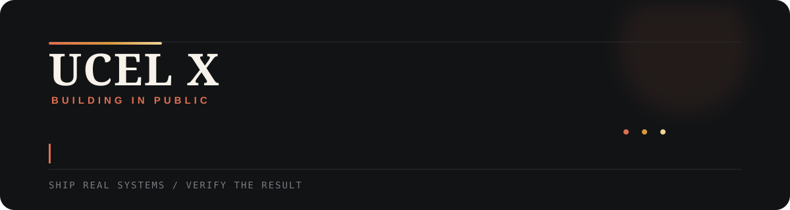

<p align="center">
  
</p>

<p align="center">
  <a href="https://x.com/UCEL_X"></a>
  <a href="https://github.com/UcelX?tab=repositories"></a>
</p>

I build practical tools around AI agents, Web3 automation, browser workflows, and self-hosted infrastructure. Most of the work starts with a problem I hit myself, then gets packaged so other people can run it on their own machine.

### Selected work

<table>
<tr>
<td width="50%" valign="top">

#### [captcha-solver](https://github.com/UcelX/captcha-solver)

Local-first toolkit for integrating CAPTCHA and web-challenge solvers without tying an application to one provider.

`Python` · `Browser automation` · `Self-hosted`

</td>
<td width="50%" valign="top">

#### [x-actions](https://github.com/UcelX/x-actions)

X/Twitter automation through API and browser/CDP paths, with practical fallback handling.

`Python` · `CDP` · `Automation`

</td>
</tr>
<tr>
<td width="50%" valign="top">

#### [agentforge-skills](https://github.com/UcelX/agentforge-skills)

Engineering playbooks for autonomous coding agents that need to debug, test, and ship real software.

`AI agents` · `TDD` · `Developer tooling`

</td>
<td width="50%" valign="top">

#### [grok-register-hybrid](https://github.com/UcelX/grok-register-hybrid)

Self-hosted integration toolkit for Grok registration, SSO capture, mailbox adapters, and account pooling.

`Python` · `OAuth/SSO` · `Self-hosted`

</td>
</tr>
</table>

### How I work

```text
inspect the real system
        ↓
reproduce the failure
        ↓
fix the smallest root cause
        ↓
run tests and live verification
        ↓
package the useful parts
```

I care more about a verified result than a polished claim. If something only works in a demo, it is not finished yet.

### Current focus

- building reliable tool-using AI agents
- self-hosted model routing and API infrastructure
- Web3 and browser automation
- turning internal workflows into reusable open-source tools

### Activity

<picture>
  <source media="(prefers-color-scheme: dark)" srcset="https://raw.githubusercontent.com/UcelX/UcelX/output/github-contribution-grid-snake-dark.svg" />
  <source media="(prefers-color-scheme: light)" srcset="https://raw.githubusercontent.com/UcelX/UcelX/output/github-contribution-grid-snake.svg" />
  
</picture>

---

<p align="center"><sub>Build it. Break it on purpose. Verify the fix.</sub></p>
